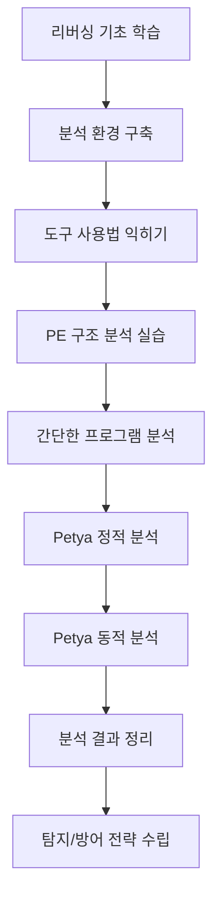

# Petya 랜섬웨어 리버싱 학습 프로젝트

<div align="center">

[](https://opensource.org/licenses/MIT)
[](README.md)

**⚠️ 교육 목적 전용 - 불법적인 사용 엄격히 금지 ⚠️**

</div>

---

## 📚 목차

- [프로젝트 소개](#-프로젝트-소개)
- [학습 목표](#-학습-목표)
- [리포지토리 구조](#-리포지토리-구조)
- [시작하기](#-시작하기)
- [학습 로드맵](#-학습-로드맵)
- [법적/윤리적 주의사항](#️-법적윤리적-주의사항)
- [기여하기](#-기여하기)
- [라이선스](#-라이선스)

---

## 🎯 프로젝트 소개

이 프로젝트는 **Petya 랜섬웨어**를 분석하면서 **리버스 엔지니어링의 기본 개념과 실전 기법**을 학습할 수 있는 종합적인 교육 자료입니다.

Petya는 2016년에 발견된 MBR(Master Boot Record)을 암호화하는 독특한 방식의 랜섬웨어로, 악성코드 분석과 리버싱을 학습하기에 좋은 실습 예제입니다.

### 주요 특징

- 📖 **한국어 문서**: 모든 문서가 한국어로 작성되어 있습니다
- 👨‍🎓 **초보자 친화적**: 리버싱을 처음 시작하는 분들도 따라할 수 있도록 상세하게 설명합니다
- 🛠️ **실습 중심**: 실제 도구와 명령어를 사용한 단계별 가이드를 제공합니다
- 🔒 **안전 우선**: 안전한 분석 환경 구축 방법을 강조합니다
- 📊 **체계적 학습**: 기초부터 고급까지 단계적으로 학습할 수 있습니다

---

## 🎓 학습 목표

이 프로젝트를 완료하면 다음을 할 수 있게 됩니다:

1. **리버스 엔지니어링 기본 개념** 이해
   - 정적 분석과 동적 분석의 차이
   - 디스어셈블러와 디버거 사용법
   - x86/x64 어셈블리 언어 읽기

2. **악성코드 분석 환경 구축**
   - 안전한 가상 머신 환경 설정
   - 필수 분석 도구 설치 및 설정
   - 네트워크 격리 구성

3. **PE 파일 구조 분석**
   - PE 헤더 구조 이해
   - Import/Export 테이블 분석
   - 섹션 분석 및 엔트로피 계산

4. **Petya 랜섬웨어 분석**
   - MBR 암호화 메커니즘 이해
   - 암호화 알고리즘 식별
   - 감염 및 전파 방식 분석

5. **탐지 및 방어 전략 수립**
   - IOC(Indicators of Compromise) 추출
   - 탐지 시그니처 생성
   - 방어 방안 제안

---

## 📁 리포지토리 구조

```
petya-reversing/
│
├── README.md                           # 프로젝트 소개 (이 파일)
│
├── docs/                               # 학습 문서
│   ├── reversing-basics.md            # 리버싱 기본 개념
│   ├── setup-environment.md           # 실습 환경 설정 가이드
│   ├── petya-analysis-guide.md        # Petya 상세 분석 가이드
│   └── analysis-steps.md              # 단계별 분석 체크리스트
│
├── resources/                          # 참고 자료
│   ├── tools.md                       # 리버싱 도구 목록
│   └── references.md                  # 학습 리소스 및 참고 자료
│
└── notes/                              # 분석 노트
    └── analysis-log-template.md       # 분석 로그 템플릿
```

---

## 🚀 시작하기

### 1단계: 기본 개념 학습

먼저 리버스 엔지니어링의 기본 개념을 학습하세요:

- 📖 [리버싱 기본 개념](docs/reversing-basics.md) - 리버싱이란 무엇이며, 어떤 도구를 사용하는지 배웁니다

### 2단계: 분석 환경 구축

안전한 분석 환경을 설정하세요:

- 🔧 [실습 환경 설정](docs/setup-environment.md) - 가상 머신과 분석 도구를 설치합니다

### 3단계: 분석 방법론 학습

체계적인 분석 방법을 익히세요:

- 📋 [단계별 분석 체크리스트](docs/analysis-steps.md) - 실전에서 사용할 수 있는 분석 절차를 배웁니다

### 4단계: Petya 분석 실습

실제 Petya 랜섬웨어를 분석해보세요:

- 🔍 [Petya 분석 가이드](docs/petya-analysis-guide.md) - Petya의 동작 방식을 상세히 분석합니다

### 5단계: 분석 결과 정리

학습한 내용을 정리하세요:

- 📝 [분석 로그 템플릿](notes/analysis-log-template.md) - 분석 결과를 체계적으로 기록합니다

---

## 🗺️ 학습 로드맵



### 추천 학습 순서

1. **Week 1-2: 기초 다지기**
   - 리버싱 개념 학습
   - 어셈블리 언어 기초
   - 분석 환경 구축

2. **Week 3-4: 도구 익히기**
   - Ghidra/IDA 사용법
   - 디버거 실습
   - PE 구조 분석

3. **Week 5-6: 실전 분석**
   - 간단한 프로그램 분석
   - Petya 정적 분석
   - 코드 흐름 추적

4. **Week 7-8: 고급 분석**
   - Petya 동적 분석
   - 암호화 루틴 분석
   - IOC 추출

---

## ⚠️ 법적/윤리적 주의사항

### 🔴 중요: 반드시 읽어주세요

이 프로젝트는 **오직 교육 및 연구 목적**으로만 사용되어야 합니다.

#### 금지 사항

❌ **절대 금지되는 행위:**
- 타인의 시스템에 무단으로 악성코드를 실행하는 행위
- 악성코드를 이용한 불법적인 데이터 탈취
- 학습한 기술을 이용한 사이버 공격
- 악성코드의 불법 배포 또는 공유
- 승인받지 않은 시스템에 대한 침투 테스트

#### 합법적 사용

✅ **허용되는 행위:**
- 개인 소유의 격리된 환경에서 학습 목적으로 분석
- 보안 연구 및 방어 전략 개발
- 교육 기관에서의 수업 자료 활용
- 기업 보안팀의 위협 인텔리전스 연구

#### 법적 책임

- 이 프로젝트의 자료를 이용한 모든 행위에 대한 법적 책임은 사용자 본인에게 있습니다
- 한국의 정보통신망법, 형법 등 관련 법규를 준수해야 합니다
- 국제적으로도 각 국가의 사이버 보안 관련 법률을 준수해야 합니다

#### 윤리 강령

보안 연구자로서 다음 윤리를 지켜주세요:

1. **책임감**: 학습한 지식을 사회에 긍정적으로 기여하는 데 사용
2. **투명성**: 발견한 취약점을 적절한 경로로 보고
3. **존중**: 타인의 프라이버시와 재산을 존중
4. **전문성**: 지속적인 학습과 윤리적 행동 유지

---

## 🛡️ 안전 수칙

악성코드를 다룰 때는 항상 다음 사항을 준수하세요:

1. ✅ **격리된 가상 머신**에서만 분석 수행
2. ✅ **네트워크 연결 차단** (호스트 전용 네트워크 사용)
3. ✅ **스냅샷 생성** 후 분석 시작
4. ✅ **공유 폴더 비활성화**로 호스트 보호
5. ✅ **실제 악성코드는 암호화**하여 보관
6. ✅ **분석 후 VM 상태 복원** 또는 삭제

---

## 🤝 기여하기

이 프로젝트에 기여하고 싶으신가요? 환영합니다!

### 기여 방법

1. 이 리포지토리를 Fork 합니다
2. 새로운 브랜치를 생성합니다 (`git checkout -b feature/improvement`)
3. 변경 사항을 커밋합니다 (`git commit -am 'Add new feature'`)
4. 브랜치에 Push 합니다 (`git push origin feature/improvement`)
5. Pull Request를 생성합니다

### 기여 가이드라인

- 문서의 오타나 오류 수정
- 더 나은 설명이나 예제 추가
- 새로운 학습 자료나 도구 추천
- 번역 개선 및 명확성 향상

---

## 📞 문의 및 지원

질문이나 제안사항이 있으시면:

- 📧 Issues 탭에서 질문 작성
- 💬 Discussions에서 커뮤니티와 소통

---

## 📄 라이선스

이 프로젝트는 MIT 라이선스 하에 배포됩니다. 자세한 내용은 [LICENSE](LICENSE) 파일을 참조하세요.

---

## 🙏 감사의 말

이 프로젝트는 전 세계 보안 연구자들의 연구와 공개된 자료를 바탕으로 만들어졌습니다.

- 악성코드 분석 커뮤니티
- 오픈소스 리버싱 도구 개발자들
- 보안 연구 및 교육에 헌신하는 모든 분들

---

<div align="center">

**🔐 안전하게 학습하고, 책임감 있게 사용하세요! 🔐**

Made with ❤️ for the cybersecurity community

</div>